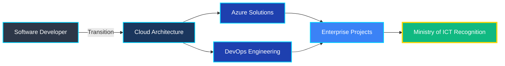

<div align="center">

<!-- Animated Header -->


<!-- Typing SVG -->
<a href="https://git.io/typing-svg"></a>

<br/>

<!-- Social Badges with Animation -->
<p align="center">
  <a href="https://www.linkedin.com/in/mohamed-sarhan7">
    
  </a>
  <a href="mailto:mohamedsarhan976@gmail.com">
    
  </a>
  <a href="https://github.com/Mohamed-Sarhan-Elhussieny">
    
  </a>
</p>

<!-- Profile Views Counter with Cool Design -->
<p align="center">
  
  
  
</p>

</div>

<!-- Snake Animation -->
<picture>
  <source media="(prefers-color-scheme: dark)" srcset="https://raw.githubusercontent.com/Mohamed-Sarhan-Elhussieny/Mohamed-Sarhan-Elhussieny/output/github-contribution-grid-snake-dark.svg">
  <source media="(prefers-color-scheme: light)" srcset="https://raw.githubusercontent.com/Mohamed-Sarhan-Elhussieny/Mohamed-Sarhan-Elhussieny/output/github-contribution-grid-snake.svg">
  
</picture>

<br/><br/>

<!-- About Me Section with Cool Design -->


## 🚀 About Me

```typescript
const mohamedSarhan = {
    title: "Cloud & DevOps Engineer",
    location: "Ismailia, Egypt 🇪🇬",
    education: "Electronics & Communications Engineering",
    university: "Suez Canal University",
    
    certifications: [
        "Microsoft Certified: Azure Fundamentals (AZ-900) ☁️",
        "Top DEPI Project Award 🏆"
    ],
    
    achievements: {
        capstoneProject: "Selected as Top Project",
        presentedTo: "Ministry of ICT Officials",
        gpa: "3.27 (Very Good)",
        graduationProject: "Excellent"
    },
    
    currentFocus: [
        "Advanced Azure Architecture",
        "Kubernetes Orchestration",
        "Infrastructure Automation",
        "CI/CD Pipeline Optimization"
    ],
    
    funFact: "Transitioned from Embedded Systems to Cloud Architecture! 🔄"
};
```

<br clear="right"/>

---

## 🛠️ Tech Arsenal

<div align="center">

### ☁️ Cloud Platforms & Services
<p>
  
  
  
</p>

### 🔄 DevOps & Automation
<p>
  
  
  
  
  
  
</p>

### 💻 Programming & Scripting
<p>
  
  
  
  
</p>

### 🐧 Operating Systems
<p>
  
  
  
</p>

### 🔧 Tools & Version Control
<p>
  
  
  
  
  
</p>

### 📊 Databases & Monitoring
<p>
  
  
  
</p>

</div>

---

## 🏆 Featured Projects

<div align="center">

<table>
<tr>
<td width="50%">

### 🌟 Azure Infrastructure Deployment
#### 🏅 Top DEPI Project - Ministry of ICT Award


**Enterprise-Grade Cloud Infrastructure**

- 🏗️ Complete Azure architecture design
- ⚡ Azure VMs, VNets, Load Balancers
- 🔐 Active Directory integration
- 💾 Azure SQL with backup solutions
- 🛡️ Security hardening implementation

**Tech:** `Azure` `Terraform` `Ansible` `Docker`

</td>
<td width="50%">

### 🛒 Cloud-Native E-Commerce Platform


**Scalable Multi-Tier Application**

- 🌐 Azure Load Balancer setup
- 🐧 Multiple Linux VMs orchestration
- 🗃️ High-availability SQL Database
- 🔒 User authentication system
- 🐳 Dockerized microservices

**Tech:** `Azure` `Docker` `SQL` `Linux` `DNS`

</td>
</tr>
<tr>
<td width="50%">

### 🔄 Automated CI/CD Pipeline


**End-to-End Automation**

- ☸️ AWS EKS cluster deployment
- 🔧 Jenkins on Kubernetes pods
- 🪝 GitHub webhook integration
- 🐳 Automated Docker builds
- 🚀 Continuous deployment pipeline

**Tech:** `AWS` `EKS` `Jenkins` `K8s` `Docker`

</td>
<td width="50%">

### 🎯 More Projects Coming Soon...


**Currently Working On:**

- 🌟 GitOps with ArgoCD
- 📊 Observability Stack (ELK + Grafana)
- 🔐 Zero-Trust Architecture
- 🤖 Infrastructure Automation Templates

**Stay Tuned!** 🚀

</td>
</tr>
</table>

</div>

---

## 📊 GitHub Analytics

<div align="center">
  
<!-- GitHub Stats Cards -->


<br/>

<!-- Streak Stats -->


<br/>

<!-- Activity Graph -->


</div>

---

## 🎓 Certifications & Achievements

<div align="center">

| 🏆 Achievement | 📅 Date | 🔗 Details |
|---------------|---------|-----------|
| **Microsoft Certified: Azure Fundamentals** | June 2024 | AZ-900 (C1733U-8DF16F) |
| **Top DEPI Capstone Project** | Dec 2024 | Presented to Ministry of ICT |
| **DEPI Azure Solution Architect Track** | Apr-Dec 2024 | AZ-900, DP-900, AZ-104, AZ-305, AZ-500 |
| **ITI Cloud Computing Track** | Jun-Aug 2023 | Linux, Docker, Kubernetes, AWS |
| **Bachelor's Degree - Excellent Project** | July 2024 | GPA: 3.27 (Very Good) |

</div>

---

## 📈 Contribution Graph

<div align="center">


</div>

---

## 💼 Professional Experience

<div align="center">



</div>

---

## 🎯 Current Learning Path

<div align="center">

```yaml
2025_Goals:
  Azure_Certifications:
    - AZ-104: Azure Administrator ⏳
    - AZ-305: Azure Solutions Architect Expert ⏳
    - AZ-500: Azure Security Engineer ⏳
  
  Advanced_Skills:
    - GitOps: [ArgoCD, FluxCD]
    - Service_Mesh: [Istio, Linkerd]
    - Observability: [ELK Stack, Grafana, Jaeger]
    - Security: [HashiCorp Vault, Azure Key Vault]
  
  Contributing_To:
    - Open Source Cloud Tools
    - Terraform Modules
    - Kubernetes Operators
```

</div>

---

## 🤝 Let's Collaborate!

<div align="center">


### 🌟 Open to Collaboration On:

🚀 **Cloud Infrastructure Projects** | ⚡ **DevOps Automation** | 🔧 **CI/CD Pipelines** | ☸️ **Kubernetes Solutions**

### 💼 Currently Seeking:

**Cloud Engineer | DevOps Engineer | Azure Solutions Architect Roles**

</div>

---

## 📫 Contact Me

<div align="center">

<a href="https://www.linkedin.com/in/mohamed-sarhan7">
  
</a>
<a href="mailto:mohamedsarhan976@gmail.com">
  
</a>
<a href="https://github.com/Mohamed-Sarhan-Elhussieny">
  
</a>

<br/><br/>

### 💡 Quote of the Day


<br/>

**⚡ "From bits to bytes, from circuits to clouds - Engineering excellence knows no bounds!"**

</div>

---

<div align="center">

### 🌟 Show Some Love!

**If you like my work, consider:**

⭐ **Starring my repositories**  
👥 **Following me on GitHub**  
🤝 **Connecting on LinkedIn**

<br/>

**📍 Location:** Ismailia, Egypt 🇪🇬  
**📧 Email:** mohamedsarhan976@gmail.com  
**🌐 Languages:** Arabic (Native) | English (Fluent)

</div>

<!-- Animated Footer -->

